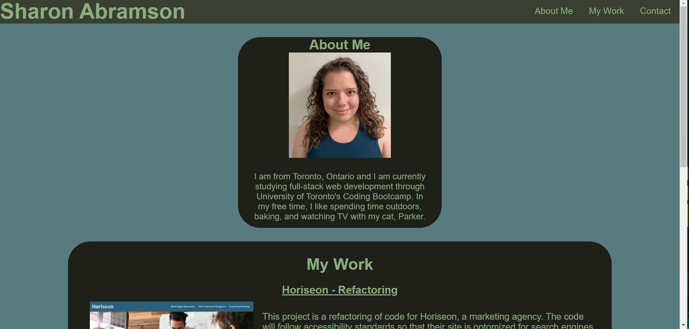

# Challenge 2 - Portfolio Page

## Description

This project is a portfolio page showcasing web applications that I, the developer, have deployed. The page includes an "About Me" section, a section that showcases deployed web applications, and how to contact me.

## Installation

 The CSS and images are located in assets. This can be deployed on a web server, such as Github Pages.

## Usage

There are several uses on this page. When the user clicks on the navigtion items, the UI will scroll to the corresponding section. When the user hovers over the navigation items, the item will turn a different colour. When the user clicks on "LinkedIn" and "Github" they will be sent to the developers respective pages. When the user clicks on the images in the "My Work" section, the user is taken to that deployed application. The developer is using placeholders for the second, and third application, so the user will be taken to www.google.com when clicking on those images. 

The website can be launched by using GitHub pages, and follwing this URL: https://sabramson16.github.io/challenge2-portfolio/

## Credits

Credits and ownership goes to Sharon Abramson. 
Colour scheme sourced from https://coolors.co/.

## License

MIT License

Copyright (c) [2023] [Sharon Abramson]

Permission is hereby granted, free of charge, to any person obtaining a copy
of this software and associated documentation files (the "Software"), to deal
in the Software without restriction, including without limitation the rights
to use, copy, modify, merge, publish, distribute, sublicense, and/or sell
copies of the Software, and to permit persons to whom the Software is
furnished to do so, subject to the following conditions:

The above copyright notice and this permission notice shall be included in all
copies or substantial portions of the Software.

THE SOFTWARE IS PROVIDED "AS IS", WITHOUT WARRANTY OF ANY KIND, EXPRESS OR
IMPLIED, INCLUDING BUT NOT LIMITED TO THE WARRANTIES OF MERCHANTABILITY,
FITNESS FOR A PARTICULAR PURPOSE AND NONINFRINGEMENT. IN NO EVENT SHALL THE
AUTHORS OR COPYRIGHT HOLDERS BE LIABLE FOR ANY CLAIM, DAMAGES OR OTHER
LIABILITY, WHETHER IN AN ACTION OF CONTRACT, TORT OR OTHERWISE, ARISING FROM,
OUT OF OR IN CONNECTION WITH THE SOFTWARE OR THE USE OR OTHER DEALINGS IN THE
SOFTWARE.